# Rotary Engine Compression Tool

Cheap DIY tool for testing rotary engines!

## Hardware required

STM32F103C8T6 (price 4$)
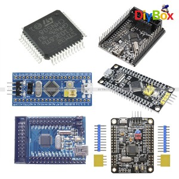

ST-Link V2 (price 3$)
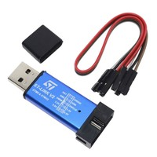

CP2102 MICRO USB to UART TTL Module (price 2$)
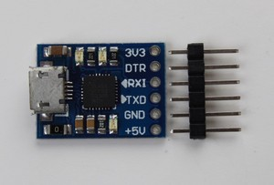

Pressure transducer 5V 200PSI (price 15$)
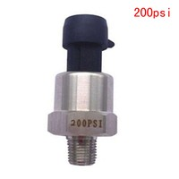

Dorman 42000 Spark Plug Non-Fouler - 14mm Gasket Seat (price 8$)
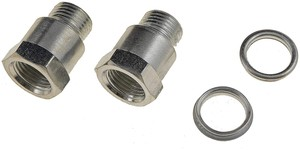

Anderson Metals Brass Threaded Pipe Fitting, Hex Bushing, 1/4" Male x 1/8" Female (price 7$)
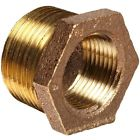

## Assembling

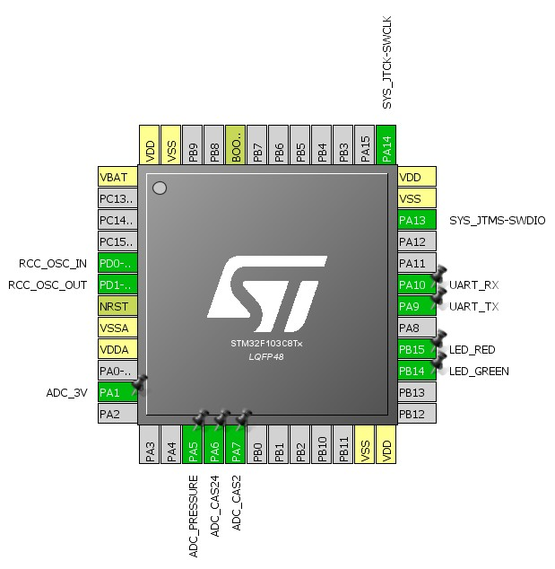
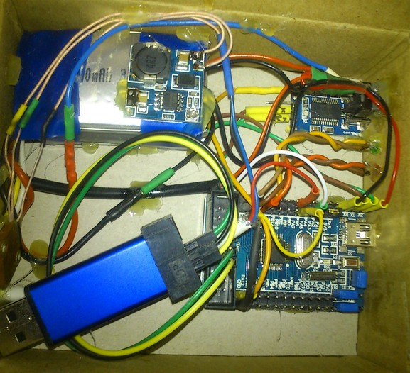
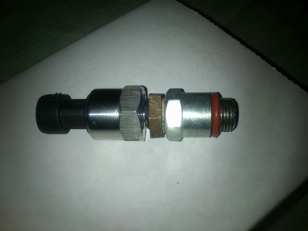

## Software

STM32 project files for most popular IDEs can be generated using STM32CubeMX (open REKT.ioc)

I'm lazy and using VisualGDB (included REKT.sln)

GUI app can be compiled via Visual Studio 2015 Community (open REKTUI.sln)

Download [precompiled files](https://drive.google.com/open?id=1Uk5_f99KuZ31ZU57AfIUuFaROBHKnBr2)

## Testing

Install pressure transducer, launch GUI and hit connect

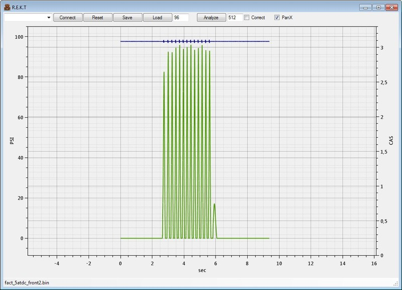
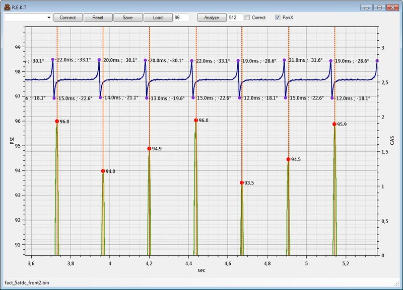
